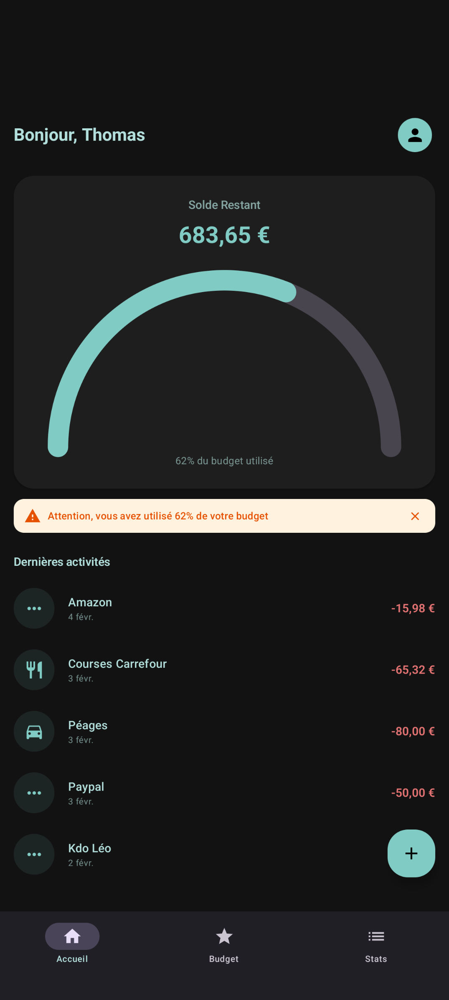
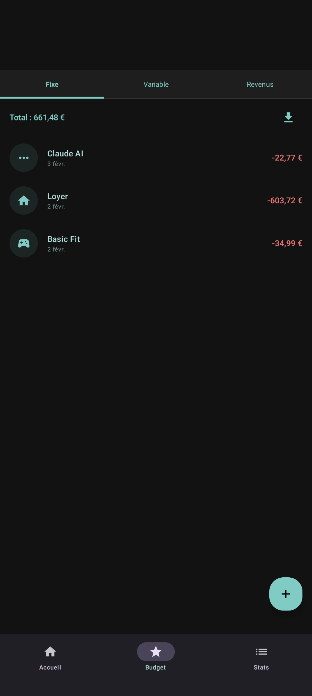
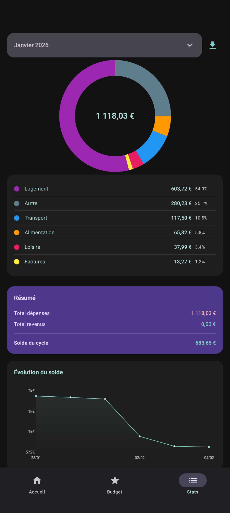
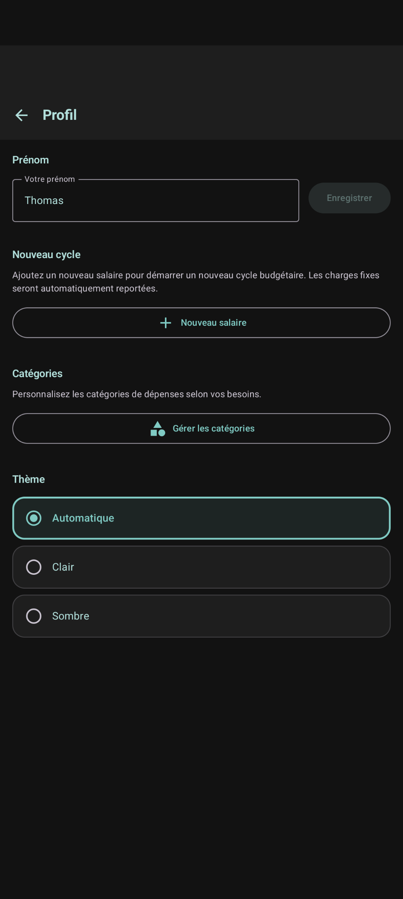

# 🐷 Pécule

**Gérez votre budget simplement, sans connexion internet.**

[](https://developer.android.com)
[](https://kotlinlang.org)
[](https://github.com/T-Flag/Pecule/actions)
[](LICENSE)

---

## 📱 Captures d'écran

| Dashboard | Budget | Statistiques | Profil |
|:---------:|:------:|:------------:|:------:|
|  |  |  |  |

---

## ✨ Fonctionnalités

| | Fonctionnalité |
|:-:|:---------------|
| 📅 | **Cycles budgétaires** — Gérez vos budgets par période (mois, quinzaine...) |
| 💸 | **Dépenses & revenus** — Suivi des transactions fixes et variables |
| 📊 | **Tableau de bord** — Jauge animée et solde en temps réel |
| 📈 | **Statistiques** — Donut chart par catégorie, évolution du solde |
| 🏷️ | **Catégories personnalisables** — Couleurs et icônes au choix |
| 📄 | **Export CSV & PDF** — Partagez vos rapports facilement |
| ⚠️ | **Alertes budget** — Notifications visuelles quand le budget est critique |
| 🌙 | **Thèmes** — Clair, sombre ou automatique |
| 📴 | **100% hors ligne** — Aucune connexion requise, données locales uniquement |

---

## 🛠️ Stack technique

| Technologie | Version | Usage |
|-------------|---------|-------|
| **Kotlin** | 2.0.21 | Langage |
| **Jetpack Compose** | BOM 2024.09.00 | UI déclarative |
| **Room** | 2.6.1 | Base de données locale |
| **Hilt** | 2.52 | Injection de dépendances |
| **DataStore** | 1.1.2 | Préférences utilisateur |
| **Coroutines** | 1.9.0 | Programmation asynchrone |

---

## 🏗️ Architecture

```
┌─────────────────────────────────────────────────────────┐
│                      UI Layer                           │
│  ┌─────────────┐  ┌─────────────┐  ┌─────────────┐     │
│  │   Screens   │  │  ViewModels │  │  Components │     │
│  │  (Compose)  │  │  (StateFlow)│  │  (Reusable) │     │
│  └─────────────┘  └─────────────┘  └─────────────┘     │
├─────────────────────────────────────────────────────────┤
│                    Domain Layer                         │
│  ┌─────────────┐  ┌─────────────┐  ┌─────────────┐     │
│  │  Use Cases  │  │  Calculators│  │   Models    │     │
│  │             │  │  (Balance,  │  │(Transaction)│     │
│  │             │  │   Alerts)   │  │             │     │
│  └─────────────┘  └─────────────┘  └─────────────┘     │
├─────────────────────────────────────────────────────────┤
│                     Data Layer                          │
│  ┌─────────────┐  ┌─────────────┐  ┌─────────────┐     │
│  │ Repositories│  │  Room DAOs  │  │  DataStore  │     │
│  │ (Interfaces)│  │  (SQLite)   │  │(Preferences)│     │
│  └─────────────┘  └─────────────┘  └─────────────┘     │
└─────────────────────────────────────────────────────────┘
```

**Pattern** : MVVM + Clean Architecture avec injection de dépendances Hilt.

---

## 🧪 Tests

- **~200 tests unitaires** couvrant ViewModels, Repositories, Calculators
- Développement en **TDD** (Test-Driven Development)
- **CI/CD** avec GitHub Actions : tests automatiques sur chaque push

```bash
# Lancer les tests
./gradlew test
```

---

## 🚀 Installation

### Prérequis
- Android Studio Ladybug (2024.2.1) ou supérieur
- JDK 11+
- Android SDK 26+ (Android 8.0)

### Étapes

```bash
# 1. Cloner le repository
git clone https://github.com/T-Flag/Pecule.git

# 2. Ouvrir dans Android Studio
cd Pecule && studio .

# 3. Builder le projet
./gradlew assembleDebug

# 4. Installer sur un appareil/émulateur
./gradlew installDebug
```

---

## 📋 Politique de confidentialité

Pécule ne collecte **aucune donnée personnelle**. Toutes les informations restent sur votre appareil.

👉 [Lire la politique complète](https://t-flag.github.io/Pecule/privacy-policy.html)

---

## 📄 Licence

```
MIT License

Copyright (c) 2026 T-Flag

Permission is hereby granted, free of charge, to any person obtaining a copy
of this software and associated documentation files (the "Software"), to deal
in the Software without restriction, including without limitation the rights
to use, copy, modify, merge, publish, distribute, sublicense, and/or sell
copies of the Software, and to permit persons to whom the Software is
furnished to do so, subject to the following conditions:

The above copyright notice and this permission notice shall be included in all
copies or substantial portions of the Software.

THE SOFTWARE IS PROVIDED "AS IS", WITHOUT WARRANTY OF ANY KIND, EXPRESS OR
IMPLIED, INCLUDING BUT NOT LIMITED TO THE WARRANTIES OF MERCHANTABILITY,
FITNESS FOR A PARTICULAR PURPOSE AND NONINFRINGEMENT. IN NO EVENT SHALL THE
AUTHORS OR COPYRIGHT HOLDERS BE LIABLE FOR ANY CLAIM, DAMAGES OR OTHER
LIABILITY, WHETHER IN AN ACTION OF CONTRACT, TORT OR OTHERWISE, ARISING FROM,
OUT OF OR IN CONNECTION WITH THE SOFTWARE OR THE USE OR OTHER DEALINGS IN THE
SOFTWARE.
```

---

<p align="center">
  Fait avec ❤️ en Kotlin
</p>
